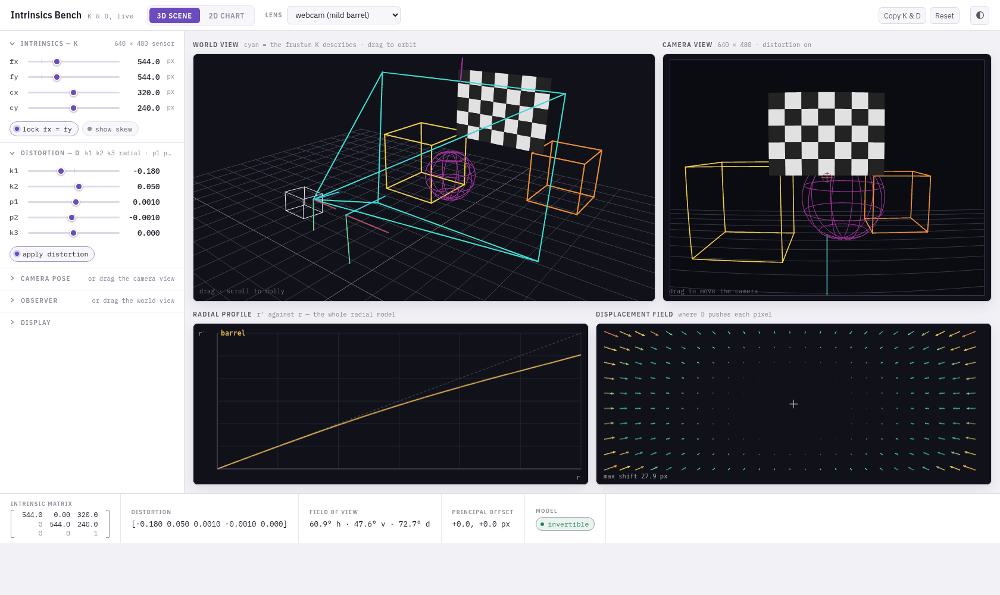

# learn_camera_intrinsics

**Learn what a camera's intrinsic parameters actually do — by moving them and
watching what breaks.**

[](https://github.com/cyhunblr/learn_camera_intrinsics/actions/workflows/ci.yml)
[](https://cyhunblr.github.io/learn_camera_intrinsics/)
[](LICENSE)

[**▶ Open the interactive viewer**](https://cyhunblr.github.io/learn_camera_intrinsics/)
— no install, runs in your browser.



---

## What this is

A short, self-contained course on the two objects that turn a 3D point into a
pixel: the intrinsic matrix **`K`** and the distortion vector **`D`**.

Most people meet them as a YAML file they copy from one project to another. This
repository is for the moment that stops working — when the image is resized, the
frame is cropped, the lens is swapped, or a calibration with a beautiful RMS
turns out to be quietly wrong.

It is deliberately narrow. No stereo, no SLAM, no epipolar geometry. Those all
sit on top of this, and they are hard to learn while you are still unsure
whether `cx` moves the camera or the image.

**By the end you should be able to** read a `K` and say what the camera sees,
predict what a distortion vector does before you plot it, fix your intrinsics
after any preprocessing step, and tell a good calibration from a lucky one.

## How it teaches

Every idea arrives four times, because one of the four is the one that will
land for you.

| | |
| --- | --- |
| 📖 **Read** | Six short chapters, each ending where the next begins |
| 🎛 **Play** | A live viewer where every parameter is a slider and the 3D scene, the camera image and the distortion curves all move together |
| ⌨️ **Run** | Six narrated example programs — the same six in Python *and* C++ |
| ✍️ **Prove it** | Ten exercises to implement from scratch, and a 28-question quiz |

Python and C++ contain the same library, the same examples and the same
exercises, and they produce identical numbers. Use whichever you think in.

## Where to go

**📚 [The documentation](docs/) — start here.** It maps everything below.

| I want to… | Go to |
| --- | --- |
| Understand the concepts | [The course](docs/README.md#the-path) — six chapters, in order |
| Just play with it | [The live viewer](https://cyhunblr.github.io/learn_camera_intrinsics/) |
| Look a formula up | [The cheat sheet](docs/reference/cheatsheet.md) |
| Test myself | [Exercises](docs/practice/exercises.md) · [Quiz](docs/practice/quiz.md) |
| Run the code in Python | [Python setup](python/README.md) |
| Run the code in C++ | [C++ setup](cpp/README.md) |
| Know whether to trust the maths | [Verification](docs/reference/verification.md) |
| Contribute | [CONTRIBUTING.md](CONTRIBUTING.md) |

### The course at a glance

| # | Chapter | What it settles |
| --- | --- | --- |
| 1 | [The pinhole model](docs/course/01_pinhole_and_projection.md) | The three steps between a 3D point and a pixel |
| 2 | [The K matrix](docs/course/02_the_K_matrix.md) | What each entry does, in real units |
| 3 | [The D vector](docs/course/03_the_D_vector.md) | Why `D` has no resolution, and why the order of its five numbers is a trap |
| 4 | [Resize, crop and ROI](docs/course/04_resize_crop_and_roi.md) | The one rule that fixes `K` after any preprocessing |
| 5 | [Undistortion](docs/course/05_undistortion.md) | Why an undistorted image is a *different camera* |
| 6 | [Calibration in practice](docs/course/06_calibration_in_practice.md) | Why a low RMS proves almost nothing |

## Layout

```text
learn_camera_intrinsics/
├── docs/                 the map is docs/README.md
│   ├── course/           six chapters, meant to be read in order
│   ├── reference/        cheat sheet and verification notes
│   └── practice/         ten exercises and a 28-question quiz
├── web/                  the interactive viewer, one self-contained HTML file
├── python/               library, examples, exercises, figure renderers
├── cpp/                  the same library and programs in C++
├── scripts/              figure generation and the three-language parity check
└── data/generated/       figures used by the docs and this page
```

## Contributing

Issues and pull requests are welcome — please open an issue first so we can
agree on scope. Commit messages follow [Conventional Commits](https://www.conventionalcommits.org/)
and are checked in CI; the details are in [CONTRIBUTING.md](CONTRIBUTING.md).

## License

[MIT](LICENSE).
