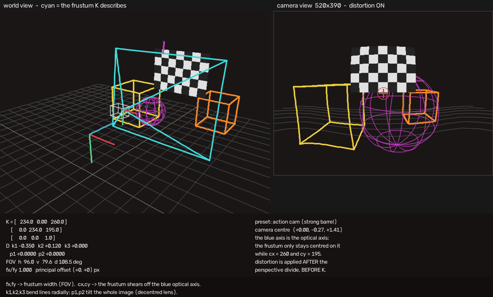

# 2. The K matrix

> Run alongside: `02_k_matrix_anatomy`, and the
> [web viewer](https://cyhunblr.github.io/learn_camera_intrinsics/) —
> watch the cyan frustum change shape as you drag `fx` and `cx`.

$$
\mathbf{K} = \begin{bmatrix} f_x & s & c_x \\ 0 & f_y & c_y \\ 0 & 0 & 1 \end{bmatrix}
\qquad
\begin{aligned}
u &= f_x x' + s\,y' + c_x \\
v &= f_y y' + c_y
\end{aligned}
$$

`K` is a 2D affine map from normalized coordinates to pixels. That is all it is.
It contains **no rotation and no translation of the camera** — it cannot move the
camera, only decide how the already-projected ray lands on the sensor grid.

## fx and fy — focal length in pixels

The physical focal length $F$ is in millimetres. The pixel pitch $p$ (the
physical width of one photosite) is also in millimetres. Their ratio is not:

$$ f_x = \frac{F}{p_x}, \qquad f_y = \frac{F}{p_y} $$

**`fx` is a length measured in pixels.** Three consequences follow immediately,
and they explain most of the confusion around intrinsics:

1. Resizing an image changes `fx`, even though the lens did not change.
   ([Chapter 4](04_resize_crop_and_roi.md).)
2. `fx ≠ fy` means the pixels are not square — or, far more often, that someone
   resized the image without preserving the aspect ratio. Modern sensors give
   `fx/fy` within about 1%. A ratio of 1.2 is a bug, not a sensor.
3. You can sanity-check any calibration in five seconds:
   $F = f_x \cdot p_x$ should match the lens on the front of the camera.
   `fx = 1000` on a 3 µm sensor means a 3 mm lens. If your datasheet says 8 mm,
   something is wrong.

### Field of view

`fx` and the image width together set the field of view:

<!-- markdownlint-disable-next-line MD013 -->
$$ \text{hFOV} = \arctan\!\left(\frac{c_x}{f_x}\right) + \arctan\!\left(\frac{W - c_x}{f_x}\right) $$

Note this is a sum of **two different half-angles**, because $c_x$ is generally
not $W/2$. The symmetric shortcut $2\arctan(W/2f_x)$ is an approximation that
happens to be exact only for a perfectly centred principal point.

Going the other way, when you have a lens spec but no calibration:

$$ f_x = \frac{W/2}{\tan(\text{hFOV}/2)} $$

A useful landmark: **90° horizontal FOV means `fx = W/2` exactly.**

| hFOV | `fx` for a 1920-wide image | feels like |
| ------ | --------------------------- | ------------ |
| 30° | 3583 | telephoto |
| 60° | 1663 | a "normal" lens |
| 90° | 960 | wide |
| 120° | 554 | very wide |
| 150° | 257 | action camera |

## cx and cy — the principal point

$(c_x, c_y)$ is where the optical axis pierces the sensor. It is *near* the image
centre but essentially never exactly at it: the sensor is glued on by a machine
with a tolerance, so a real calibration returns something like `cx = 962.4` on a
1920-wide image rather than `960.0`.

Moving `cx` **slides the image**. It does not rotate the camera. This is worth
dwelling on, because visually the two look similar over a small range:

* A **rotation** changes which rays enter the lens at all. Objects at infinity
  move; the vanishing point of a road moves; new scenery appears at one edge.
* A **`cx` shift** changes only which pixel index a given ray is reported at.
  The set of rays entering the camera is identical.

In the viewer's 3D tab, drag `cx` and watch: the cyan frustum shears sideways
while the
blue optical-axis arrow of the camera triad stays put. The frustum is no longer
symmetric about the axis. That asymmetry *is* the principal-point offset.

## skew

`s` models sensor axes that are not perpendicular — an artefact of digitising
film. It is **0** for every digital sensor you will meet.

Worth knowing: **`cv2.projectPoints` ignores `K[0,1]` entirely.** It computes
`u = fx*x'' + cx` with no skew term. So if you set a nonzero skew and compare
this repository's `project_points` against OpenCV's, they will disagree — not
because either is wrong, but because OpenCV does not implement that term. This
repository does implement it, which is why the viewer
keeps it behind a "show skew" switch.

## What K cannot do

| You want to… | `K` can do it? |
| --- | --- |
| Zoom in | yes — raise `fx`, `fy` |
| Shift the image on the sensor | yes — move `cx`, `cy` |
| Stretch the image | yes — change `fx/fy` |
| **Rotate the camera** | **no** — that is `R` in the extrinsics |
| **Move the camera** | **no** — that is `t` |
| **Bend a straight line** | **no** — that is `D`; `K` is affine, and affine maps send straight lines to straight lines |

That last row is the useful diagnostic. If straight edges in your image are
curved, no value of `K` will ever fix them.

## Check yourself

* Exercise 1 (`build_K`), 4 (`fov_degrees`), 8 (`K_from_hfov`).
* Quiz: `uv run python/quiz/run_quiz.py --topic K`

**Next:** [The D vector](03_the_D_vector.md)
