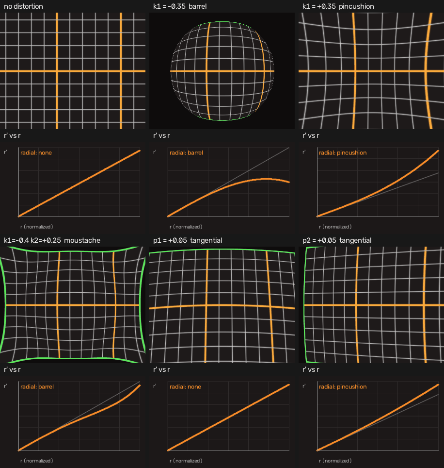

# 3. The D vector

> Run alongside: `03_distortion_anatomy`, and the [web viewer](https://cyhunblr.github.io/learn_camera_intrinsics/)'s
> 2D tab — pick the grid chart and drag `k1`.



## Where it acts

Distortion is applied in **normalized coordinates**, after the perspective
divide and before `K`. That single fact answers most questions about it:

* `D` is **unitless** and has **no resolution**. Resize an image and `D` is
  unchanged. If someone offers you "the D for 640×480", they are confused.
* `D` is a property of the **lens**, not of the sensor or the image pipeline.
* Because it sits between the divide and `K`, it cannot be folded into a
  projection matrix. That is why `P = K[R|t]` has no room for it.

## The model

OpenCV uses the Brown–Conrady ("plumb bob") model. With
$r^2 = x^2 + y^2$:

<!-- markdownlint-disable MD013 -->
$$
\begin{aligned}
\text{radial} &= \frac{1 + k_1 r^2 + k_2 r^4 + k_3 r^6}{1 + k_4 r^2 + k_5 r^4 + k_6 r^6} \\[4pt]
x' &= x \cdot \text{radial} + \underbrace{2 p_1 x y + p_2 (r^2 + 2x^2)}_{\text{tangential}} \\
y' &= y \cdot \text{radial} + \underbrace{p_1 (r^2 + 2y^2) + 2 p_2 x y}_{\text{tangential}}
\end{aligned}
$$
<!-- markdownlint-enable MD013 -->

The denominator is the *rational* model; with the usual five coefficients
$k_4 = k_5 = k_6 = 0$ and it disappears.

### The ordering trap

```text
D = [k1, k2, p1, p2, k3]
     ^^^^^^  ^^^^^^  ^^
     radial  tangential  radial again
```

The two tangential terms sit **between** `k2` and `k3`. This is not alphabetical
and not grouped by type; it is historical. Writing `[k1, k2, k3, p1, p2]` gives
you a lens that looks approximately right and is quietly wrong everywhere — the
single most common camera bug in the wild.

## Reading the coefficients

### Radial: k1, k2, k3

The radial terms scale a point's distance from the principal point, leaving its
angle alone. Plot $r'$ against $r$ and you can read the lens at a glance:

* **`k1 < 0` — barrel.** $r' < r$: points are pulled toward the centre, so
  straight lines bow *outward*. Every wide-angle and action camera.
* **`k1 > 0` — pincushion.** $r' > r$: lines bow *inward*. Common in telephoto
  and in some zoom ranges.
* **`k1 < 0` with `k2 > 0` — moustache.** Barrel near the centre, pincushion at
  the edge. A single `k1` cannot produce this shape, which is precisely why `k2`
  exists.
* **`k3`** only matters for genuinely wide lenses. On a normal lens it is barely
  constrained by the data — see [chapter 6](06_calibration_in_practice.md) for
  what that costs you.

### Tangential: p1, p2

These model a lens that is not perfectly parallel to the sensor — decentring.
They break the radial symmetry: the image goes lopsided rather than uniformly
squeezed.

Realistic magnitudes are **1e-4 to 1e-3**. If a calibration hands you
`p1 = 0.03`, it is not describing a lens; it is absorbing noise or a systematic
error such as a mis-measured square size. Treat it as a red flag.

A useful sanity check: sample $r'$ along the $+x$ axis and `p1` contributes
nothing at all, because its term is $2 p_1 x y$ and $y = 0$ there. Tangential
effects are not radial effects; a single radial profile plot cannot show them.
Use the **displacement field** panel in the viewer instead — with pure radial
distortion the arrows point straight in or out from the principal point and
vanish there; with tangential terms they do not.

## The fold: when distortion cannot be undone

$r'(r)$ is a polynomial, and polynomials turn around. For `k1 = -0.5`:

$$ r' = r(1 - 0.5 r^2) $$

which peaks at $r = 0.816$ with $r' = 0.544$ and decreases after that. Beyond
that radius **two different rays map to the same image radius**, so the model is
no longer invertible: there is simply no $r$ that produces an $r'$ above 0.544.

`cv2.undistort` will not warn you. It runs its fixed-point iteration, fails to
converge, and returns whatever it has. Those are the smeared "petals" you
sometimes see at the corners of an over-aggressive undistort.

This repository exposes the limit directly:

```python
max_valid_radius(D)      # r where r'(r) stops increasing
max_distorted_radius(D)  # the largest r' the model can ever produce
is_invertible_over_image(K, D, w, h)   # are all four image corners recoverable?
```

The viewer turns the **Model** chip in its status bar red when the image corners
fall outside the invertible region, and marks the fold on the radial-profile
plot rather than inventing pixels past it.

If you need distortion this strong, you have a fisheye, and you want
`cv2.fisheye` — a different model with an angle-based formulation that stays
monotonic out to 180°.

## Check yourself

* Exercise 3 (`distort`), 9 (`classify_distortion`).
* Quiz: `uv run python/quiz/run_quiz.py --topic D`

**Next:** [Resize, crop and ROI](04_resize_crop_and_roi.md)
