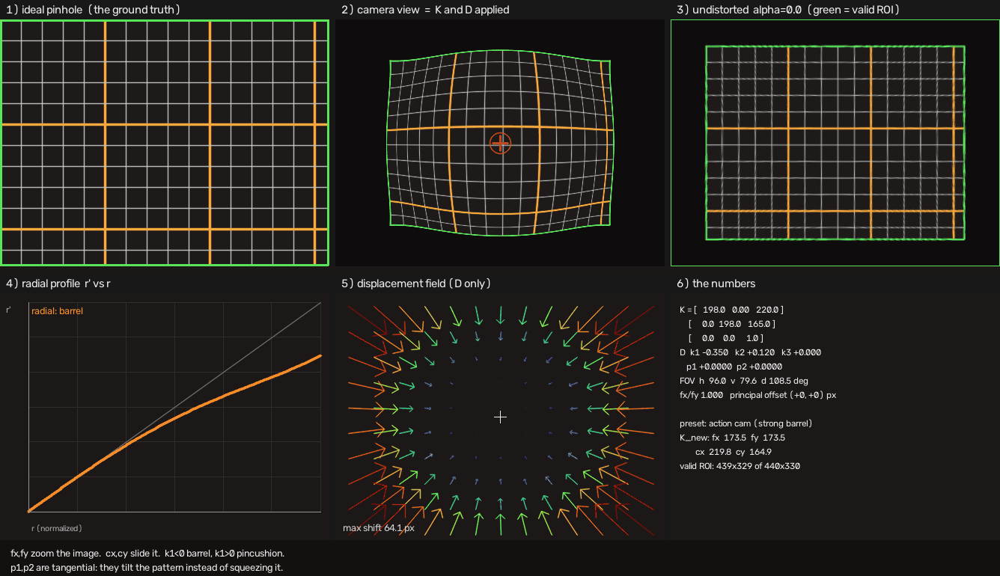

# 5. Undistortion

> Run alongside: `05_undistort_and_alpha`, and the
> [web viewer](https://cyhunblr.github.io/learn_camera_intrinsics/) —
> drag the `α` slider and watch the third pane and its green data boundary.

## Undistorting produces a different camera

This is the whole chapter in one sentence. An undistorted image is **not** your
original camera with the distortion removed; it is a new camera with

* a new intrinsic matrix `K_new`,
* a distortion vector of all zeros,
* a different field of view,
* and a region of the output containing no real data.

Keep using the old `K` on the undistorted image and every projection is wrong.
Example 5 measures the bug at 14 px near the centre of a modest wide-angle lens,
growing toward the corners.

```python
K_new, roi = cv2.getOptimalNewCameraMatrix(K, D, (w, h), alpha, (w, h))
undistorted = cv2.undistort(img, K, D, None, K_new)
# from here on: intrinsics are (K_new, zeros), NOT (K, D)
```



## The alpha knob

`alpha` chooses which rectangle of the undistorted plane you keep.

* **`alpha = 0`** — inscribe the largest rectangle that contains only real
  pixels. No black borders; you lose the parts of the frame that fell outside.
  The reported `roi` is then the whole output.
* **`alpha = 1`** — take the bounding rectangle instead, so every input pixel
  survives. You gain black curved borders, and the returned `roi` marks the
  region that is actually valid. Everything outside it is invented.

Anything in between interpolates.

### Which way does fx_new move?

Not the way most people guess, and **`alpha` is not what decides it** — the
distortion is:

| lens | what undistorting does | `fx_new` | FOV |
| --- | --- | --- | --- |
| barrel (`k1 < 0`) | the periphery was squeezed; undistorting spreads it out | **drops** | grows |
| pincushion (`k1 > 0`) | the periphery was stretched; undistorting pulls it back | **rises** | shrinks |

`alpha` only decides how much of that new image you keep. Example 5 prints both
tables side by side so you can see the two directions.

## How the inverse is computed

There is no closed-form inverse of the distortion polynomial, so it has to be
solved numerically. OpenCV uses a **fixed-point iteration**:

```text
x, y = xd, yd
repeat:
    r2 = x² + y²                       # recomputed from the CURRENT estimate
    radial = 1 + k1·r2 + k2·r2² + k3·r2³
    dx, dy = tangential terms at (x, y)
    x = (xd - dx) / radial
    y = (yd - dy) / radial
```

It is simple, it is what exercise 7 asks you to write, and it is worth
understanding — recomputing `r2` from the current estimate each pass is the
detail people get wrong.

**It is also fragile.** The iteration only converges while it is contracting,
and near the corners of a strong wide-angle lens it stops. For
`k1 = -0.34, k2 = 0.11` at the corner of a 640×480 frame it does not settle at
all; it oscillates between `r = 1.44` and `r = 1.56` indefinitely:

```text
 it  1: r = 1.6174      it  6: r = 1.4397
 it  2: r = 1.3841      it  7: r = 1.5563
 it  3: r = 1.5883      it  8: r = 1.4541
 it  4: r = 1.4187      it  9: r = 1.5461
 it  5: r = 1.5697      it 10: r = 1.4648
```

Twenty iterations leave a residual of 8e-2 in normalized units — about **26 px**.
Nothing reports an error. The point is perfectly invertible in principle (the
model does not fold until `r′ = 20.5` here); the *solver* is what failed. And it
failed exactly where lens distortion matters most.

Two consequences worth knowing:

* **More iterations do not fix it.** The sequence oscillates, so the answer
  wanders: `fx` recovered from `getOptimalNewCameraMatrix` comes out 254 at 5
  iterations, 280 at 8, 273 at 20 and 269 at 50.
* **It leaks into OpenCV's own results.** `cv2.getOptimalNewCameraMatrix` calls
  `undistortPoints` internally with the default 5 iterations, so at `alpha = 0`
  its answer inherits the error — about 7% in `fx` for the lens above.

This repository therefore solves the same equations with **Newton's method**.
Finding `(x, y)` with `distort(x, y) = (xd, yd)` is a 2×2 root find with an
analytic Jacobian, and it converges quadratically: machine precision (residual
~1e-16) across the whole image, in a handful of steps, for every lens in the
preset list. Python, C++ and the web viewer all use it and agree to the last
bit.

## Two ways to build the map

Both directions are useful and it is worth knowing which is which.

**Straighten a distorted image** (the normal case) —
`cv2.initUndistortRectifyMap(K, D, R, K_new, size)`. For each *output* pixel it
applies `K_new⁻¹`, then *distorts*, then `K`, and samples the input there.

**Fake a distorted image from an ideal one** (what this repository does to build
its demo charts) — for each *output* pixel apply `K⁻¹`, then *undistort*, then
`K_ideal`, and sample the ideal source. That is exactly
`cv2.undistortPoints(grid, K, D, P=K_ideal)`.

Both build the map **backwards**, from destination to source. Every image warp
does: forward-mapping leaves holes, backward-mapping does not.

## When you should not undistort at all

Undistorting every frame costs a full-resolution remap and throws away pixels.
Very often you do not need it:

* To **project** 3D points into the image, apply `(K, D)` directly. No warp
  needed, and it is exact.
* To **back-project** detections into 3D, run `cv2.undistortPoints` on the
  handful of pixels you care about rather than on all two million of them.
* Undistort the image only when something downstream genuinely requires straight
  lines — a lane-line fit, a homography, a stereo rectification, or a human
  looking at it.

Carrying `(K, D)` through the pipeline is usually both faster and more accurate
than carrying `(K_new, 0)` plus a resampled image.

## Check yourself

* Exercise 7 (`undistort_point`) — write the fixed-point iteration yourself.
* Quiz: `uv run python/quiz/run_quiz.py --topic undistort`

**Next:** [Calibration in practice](06_calibration_in_practice.md)
